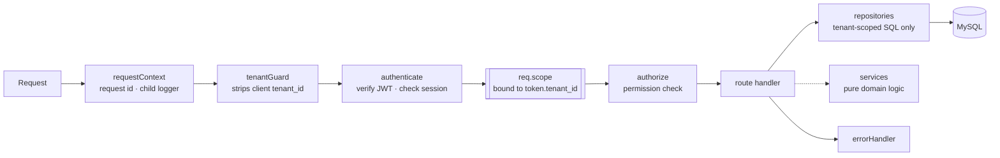

# Membership Platform API

A multi-tenant REST API for membership organisations, where tenant isolation is enforced by a data layer that refuses to compile a query without it — not by remembering to write `AND tenant_id = ?`.


---

## Overview

One database, many organisations. Members log in from a mobile app to see their dues, book a facility, issue a guest pass and request a change to their own details. Staff log in to a separate surface to approve those requests. Everything a member does that touches the member register goes through an approval workflow rather than writing directly.

The engineering subject of this repository is the first sentence: **shared-schema multi-tenancy where a single forgotten predicate is a data breach**, and what it takes to make that failure structurally impossible rather than merely unlikely.

## Problem

In a shared-schema design, every tenant's rows live in the same tables. Correctness rests on every query carrying `AND tenant_id = ?`.

That is a terrible place to put a security boundary:

- **Code review does not reliably catch a missing `WHERE` clause.** It catches a missing null check; it does not catch the absence of a line that was never written.
- **It only has to be missed once**, in one query, on one endpoint, to leak another organisation's member register.
- **The failure is silent.** A query missing its tenant predicate returns *more* rows, not an error. Nothing breaks, tests still pass, and the bug is discovered by a customer.
- **A client-supplied tenant hint is worse.** The obvious convenience — accept `tenant_id` in the request and scope by it — turns the boundary into a request parameter the attacker controls.

## Solution

**Feature code never receives a database handle.** It receives a *tenant scope*: an object bound to exactly one tenant id, constructed by the authentication middleware from the verified JWT and from nothing else.

The scope enforces three rules:

1. **Every statement must reference `:tenant`.** `compileTenantSql` walks the SQL lexically — skipping string literals, backtick identifiers and comments — and throws `TenantScopeError` if the marker is absent. **There is no flag to turn this off.**
2. **The tenant value is spliced in by the scope, never taken from the caller's parameters.** A caller cannot pass a different tenant id even by accident, because it is not a parameter they control.
3. **`insert()` sets `tenant_id` itself** and rejects any attempt to supply one.

The failure mode inverts. Forgetting the tenant predicate used to return other tenants' rows silently; now it throws on the first call, in development, with a message naming the file.

Two supporting mechanisms complete the boundary:

- **`tenantGuard` strips client-supplied tenant identifiers** from body, query and params at the edge of the request, so they cannot reach a handler at all.
- **Queries that legitimately have no tenant context** — resolving a login e-mail before you know who the user is — go through `src/data/global.js`, which is deliberately awkward and restricted to an **eight-entry allow-list of named purposes**. Adding a ninth is a visible, reviewable change.

**What this is not.** It is not a SQL parser and does not prove the predicate is *correct*: `WHERE 1=1 OR tenant_id = :tenant` would pass the marker check. It eliminates omission — overwhelmingly the common failure — and leaves the rare, deliberate one to review. That trade-off is argued in [`docs/architecture.md`](docs/architecture.md) rather than glossed over.

## Key features

- **Two authentication surfaces.** Members and staff have separate login endpoints, separate credential tables, separate JWT scopes and separate token lifetimes. A member token is not accepted on an admin route, and the check is on the scope claim, not on a role string.
- **RBAC** with a seeded permission catalogue, an `authorize(permission)` middleware, and read-only introspection endpoints so an operator can see exactly what a role grants.
- **Approval workflows.** A member's booking is created `pending` and can only become `confirmed` through a staff endpoint — unless the facility is flagged as not requiring approval, in which case it auto-confirms, still re-checking overlap inside the transaction. A member's profile change is stored as a request and only written into `members` on approval, re-filtered against the editable-field allow-list at write time. Which roles may approve is configuration, not code.
- **Audit trail.** Every approval and rejection writes an audit row **inside the same transaction as the state change**, with actor, action, entity and before/after values. The repository is append-only — no update, no delete — and refuses metadata keys that look like credentials.
- **Session revocation.** Tokens are backed by an `auth_sessions` row checked on every authenticated request, so logout and per-device revocation are real rather than advisory.
- **Password reset** with single-use, expiring, hashed tokens; consumption is atomic and revokes every session for the principal. The same response is returned whether or not the address exists.
- **Structured logging** with credential redaction, a request id on every response, and one log line per completed request.
- **Graceful shutdown** and a readiness probe that is distinct from liveness.

## Architecture



Middleware order **is** the security model, and it is documented in place in `src/app.js`. The tenant scope is constructed in `authenticate` and is the only route to the database for feature code.

| Layer | Rule |
|---|---|
| `src/config/` | `env.js` is the only file in the project that reads `process.env`. |
| `src/data/` | `tenantScope.js` — the enforcement. `global.js` — the allow-listed escape hatch. |
| `src/middleware/` | Request context, tenant guard, authentication, authorization, error handling. |
| `src/repositories/` | The only place SQL is written. Every statement carries `:tenant` except the two that provably cannot. |
| `src/services/` | Domain logic. No Express, no SQL, injectable clock — which is why the workflows are unit-testable. |
| `src/modules/` | HTTP handlers. Member surface and `/admin` surface, split at the router. |

## Tech stack

**Runtime** Node.js 18+ (developed on 22), CommonJS, no build step
**Framework** Express 4 — routing and middleware only
**Database** MySQL 8 via `mysql2/promise`, raw SQL, no ORM
**Auth** `jsonwebtoken`, `bcryptjs` at cost 12
**Tests** `node:test` — no test framework dependency
**Dependencies** Eight runtime packages, lockfile committed

## Project structure

```
├── src/
│   ├── server.js               Entry, config safety check, graceful shutdown
│   ├── app.js                  Middleware order — the security model
│   ├── routes.js               Member surface + /admin surface
│   ├── config/env.js           The only reader of process.env
│   ├── data/
│   │   ├── tenantScope.js      compileTenantSql · createTenantScope
│   │   └── global.js           Unscoped queries, allow-listed by purpose
│   ├── lib/                    errors · http · logger · passwords · tokens · validate
│   ├── middleware/             requestContext · tenantGuard · authenticate
│   │                           authorize · errorHandler
│   ├── modules/                auth · profile · facilities · bookings · invoices
│   │                           guestPasses · notifications · health
│   │   └── admin/              auth · bookings · profileChangeRequests
│   │                           members · roles · auditLogs
│   ├── repositories/           The only place SQL is written
│   └── services/               bookingWorkflow · profileChangeWorkflow
│                               passwordResetService · notifier
├── database/                   schema.sql (20 tables) · seed_demo.sql (2 tenants)
├── scripts/                    syntax-check · create-staff-user · create-member-credential
├── docs/architecture.md
└── test/                       unit/ (no database) · integration/ (RUN_DB_TESTS=1)
```

## API

Base prefix `/api/v1`. Responses are `{ "data": … }` or `{ "error": { message, code, request_id } }`, and every response carries `X-Request-Id`.

**Member surface**

| Method | Path | Notes |
|---|---|---|
| `POST` | `/auth/login` | Rate limited. `tenant_id` is read from the credential row, never from the request. |
| `POST` | `/auth/forgot-password` · `/auth/reset-password` | Single-use hashed tokens. Identical response for known and unknown addresses. |
| `GET` | `/auth/me` · `/auth/sessions` | |
| `DELETE` | `/auth/sessions/:id` | Only the caller's own session. |
| `POST` | `/auth/logout` · `/auth/logout-all` | |
| `GET` | `/profile` · `/profile/dependents` · `/profile/editable-fields` | |
| `POST` | `/profile/change-requests` | Creates a **pending** request. Writes nothing to `members`. |
| `GET` | `/facilities` · `/facilities/:id/availability?date=` | Slots computed against bookings and closures. |
| `GET` `POST` | `/bookings` | Pending, or auto-confirmed when the facility does not require approval. |
| `PATCH` | `/bookings/:id/cancel` | |
| `GET` | `/invoices` · `/invoices/summary` · `/invoices/:id` | Read-only. Amounts in cents. |
| `GET` `POST` | `/guest-passes` | 128-bit random code. |
| `PATCH` | `/guest-passes/:id/revoke` | |
| `GET` `PATCH` | `/notifications` · `/notifications/unread-count` · `/notifications/:id/read` · `/notifications/read-all` | |

**Staff surface** — every route below requires a staff-scope token.

| Method | Path | Permission | Notes |
|---|---|---|---|
| `POST` | `/admin/auth/login` · `forgot-password` · `reset-password` | — | Rate limited. |
| `GET` | `/admin/auth/me` | — | Role, resolved permissions, and which workflows the role may approve. |
| `GET` | `/admin/members` · `/admin/members/:id` | `members.view` | |
| `GET` | `/admin/bookings?status=pending` | `bookings.view` | The review queue. |
| `PATCH` | `/admin/bookings/:id/approve` · `/reject` | `bookings.approve` | Approval re-checks overlap, sets status, notifies and audits — one transaction. |
| `GET` | `/admin/profile-change-requests?status=pending` | `members.view` | With before/after values. |
| `PATCH` | `/admin/profile-change-requests/:id/approve` · `/reject` | `members.edit` | Approval re-filters against the allow-list before writing. |
| `GET` | `/admin/audit-logs` · `/admin/audit-logs/actions` | `settings.view` | Paginated, filterable by entity. |
| `GET` | `/admin/roles` · `/admin/roles/permissions` | `settings.view` | Read-only introspection. |

**Health** — `/health` (liveness, no database) and `/api/v1/health/ready` (readiness, `SELECT 1`, 503 when the database is down).

## Database

20 tables, InnoDB, `utf8mb4`. **18 carry `tenant_id`.** The two that do not are `tenants` — which *is* the registry — and `permissions`, the global application contract.

The tables worth reading first:

| Table | Why |
|---|---|
| `member_credentials` / `users` | Two separate credential stores for the two surfaces. The login row is what supplies `tenant_id`; the client never does. |
| `auth_sessions` | Makes revocation real. Checked on every authenticated request when `ENFORCE_SESSION_REVOCATION` is on. |
| `password_reset_tokens` | SHA-256 hash only, expiring, single-use, consumed atomically. |
| `bookings` | `status` transitions only through the workflow service; `pending` is the default and the approval path is the only route to `confirmed` for a facility that requires it. |
| `profile_change_requests` | The pending state for member self-service. `members` is written only on approval. |
| `audit_logs` | Append-only. Written inside the transaction that made the change. |

Seed data ships **two fictional tenants** so isolation is demonstrable rather than asserted.

## Security

- **Tenant isolation** enforced at compile time in the data layer, with client-supplied tenant identifiers stripped at the edge and unscoped queries restricted to an allow-list of eight named purposes.
- **Passwords** hashed with bcrypt at cost 12, minimum length enforced, `needsRehash` supported, and a timing-equalised miss so an unknown e-mail costs the same as a wrong password.
- **JWTs** are scope-separated (member vs staff), issuer-checked, and backed by a session row so revocation works.
- **Rate limiting** on every unauthenticated auth endpoint, keyed per (IP, e-mail) using `express-rate-limit`'s `ipKeyGenerator` so an IPv6 client cannot rotate inside its own /64 to widen the bucket.
- **`TRUST_PROXY` is configurable** and must match the real topology — documented in `.env.example`, because one hop wrong in either direction breaks the limiter. `true` is refused in production.
- **Production safety check** at boot: a missing or short `JWT_SECRET`, a wildcard CORS origin, an empty database password or a bcrypt cost below 10 exits the process with named errors rather than starting insecurely.
- **Error handling** never leaks stack traces in production; **logging** redacts credential-shaped keys, and the audit repository refuses metadata keys matching `password|token|secret|hash|credential`.
- **Enumeration resistance**: forgot-password returns the same response for known and unknown addresses, and a notifier transport failure is swallowed and logged rather than surfacing as a 500 that would distinguish the two.
- **The one dynamic SQL fragment** in the codebase — `memberRepository.applyChanges()`, which interpolates column names into a `SET` clause — is guarded by both an identifier regex and the configured allow-list, and is called out here as the function to read carefully.

## Tests

197 tests, `node:test`, no framework dependency.

```bash
npm test                                        # 189 pass, 8 skipped (no database)
RUN_DB_TESTS=1 DB_NAME=…_test npm test          # 197 pass
npm run check                                   # node --check over every source file
```

The unit suite runs with no database at all, against an in-memory executor, and proves the properties that matter:

- A token from tenant A cannot read tenant B's data.
- A `tenant_id` supplied in the body, query or params is ignored.
- SQL without the `:tenant` marker refuses to compile.
- A pending booking cannot become confirmed without an approval; an auto-confirming facility still refuses an overlap discovered inside the transaction.
- `max_advance_days` is enforced at the boundary; `requires_approval` drives both paths.
- Password reset tokens are single-use and expire.
- The audit row is written between `begin` and `commit`, not after.
- Two addresses inside one IPv6 /64 collapse to a single rate-limit bucket.

**A bug the tests caught before it ever ran:** `signMemberToken` passed `jti` both in the payload and as the `jwtid` option, which `jsonwebtoken` rejects — every token issue would have thrown at runtime. A second: `POST /bookings` returned a hardcoded "pending review by staff" message which, once auto-confirm existed, contradicted `status: "confirmed"` in the same response body.

The integration suite was executed against a live server and the API was driven end to end: a cross-tenant read returned 404, a `tenant_id` in the body was ignored, `booking_too_far_ahead` fired, one facility auto-confirmed while another stayed pending, an unauthorised role got 403, and the approval produced an audit row with the correct actor and before/after values. Observed output is recorded in [`NOTES.md`](NOTES.md).

## Installation

```bash
git clone https://github.com/carlitod199/membership-platform-api.git
cd membership-platform-api
npm install
cp .env.example .env          # then set DB_* and JWT_SECRET

mysql -u root -p -e "CREATE DATABASE membership_platform CHARACTER SET utf8mb4"
mysql -u root -p membership_platform < database/schema.sql
mysql -u root -p membership_platform < database/seed_demo.sql
```

## Environment variables

`.env.example` lists every variable the code reads, with placeholders only. The ones that change behaviour:

| Variable | Default | Purpose |
|---|---|---|
| `NODE_ENV` | `development` | `production` enables the boot safety check and suppresses error detail. |
| `JWT_SECRET` | dev placeholder | Required in production, minimum 32 characters. |
| `JWT_MEMBER_EXPIRES` `JWT_STAFF_EXPIRES` | `7d` / `12h` | Separate lifetimes per surface. |
| `ENFORCE_SESSION_REVOCATION` | `true` | Check the session row on every authenticated request. Costs one indexed query; makes logout real. |
| `BCRYPT_ROUNDS` | `12` | Minimum 10 enforced in production. |
| `MAX_FAILED_LOGIN_ATTEMPTS` | `10` | Lockout threshold; cleared by a password reset. |
| `AUTH_RATE_LIMIT_WINDOW_MS` `AUTH_RATE_LIMIT_MAX` | 15 min / 20 | Per (IP, e-mail). |
| `TRUST_PROXY` | `1` | Must match the real topology. `true` is refused in production. |
| `BOOKING_APPROVER_ROLES` `PROFILE_CHANGE_APPROVER_ROLES` | see file | Which roles may approve — configuration, not code. |
| `MEMBER_EDITABLE_FIELDS` | see file | The only member columns a change request may touch. Re-applied at write time. |

## Running locally

```bash
npm start                              # or: npm run dev
node scripts/create-staff-user.js      # bootstrap a staff login
```

Demo credentials for the seeded tenants are at the top of `database/seed_demo.sql`.

## Technical decisions

**Tenant isolation belongs in the data layer, not in a code-review checklist.** Any control that depends on a person remembering something, on every query, forever, will eventually fail. Moving it into a compile step converts a silent data leak into a loud development-time exception. That is the whole design.

**Login refuses a tenant hint, and pays for it.** The `tenant_id` comes from the credential row, which means login e-mails are **globally unique rather than unique per tenant** — the same person cannot use one address at two associations. That is a real product constraint, accepted deliberately, because the alternative is a tenant selector the client controls.

**Sessions are checked on every request.** A stateless JWT cannot be revoked, and for member records that is the wrong default. The cost is one indexed query per authenticated request, and the flag that disables it is documented as a decision rather than a tuning knob.

**Domain logic has no Express and no SQL.** `bookingWorkflow` and `profileChangeWorkflow` are pure functions over injected repositories and an injected clock. That is why the approval rules, the overlap re-check, the advance-days boundary and the audit ordering are all unit-testable without a database, and it is why the unit suite is worth trusting.

**Approval re-validates at write time.** An approved profile change is re-filtered against the editable-field allow-list before it is written, and an approved booking re-checks overlap inside the transaction. The state of the world at request time is not the state at approval time, and trusting the stored request would be trusting a stale snapshot.

**Soft deletes are hand-written, and that is a decision.** `deleted_at IS NULL` is *not* enforced by the scope compiler, unlike `tenant_id`. Three reasons, argued in `docs/architecture.md` §5: it is not a universal invariant (7 of 20 tables, and inserts and the delete itself must omit it); an enforcement that needs an opt-out half the time trains people to reach for the opt-out, which is exactly why the tenant marker works — it has none; and the blast radius differs, since a missing `tenant_id` is a cross-tenant breach while a missing `deleted_at` is a bug visible only inside one tenant.

**The mailer is a seam, not a stub.** `notifier.js` is a one-method interface with a logging default, wired at both forgot-password call sites. The default deliberately does **not** log the reset token — a bearer credential in the log store is the thing the redaction exists to prevent — so the flow genuinely cannot complete without a transport. That is stated rather than worked around.

## Not implemented

- **No e-mail or SMS transport**, so **the password reset flow is not end-to-end usable as shipped**. The integration point is one named module.
- **No push notifications.** `notifications` is the durable record and the in-app inbox; nothing reaches a device.
- **No payments.** Invoices are read-only — no provider, no webhook, no reconciliation.
- **No physical access control.** Guest passes are issued and tracked but never redeemed.
- **Audit coverage is partial by design.** Accountable decisions are audited; ordinary activity (logins, cancellations, guest passes) is not. There is no audit retention, export, or IP/user-agent capture — the workflows are pure domain functions with no request access.
- **No write endpoints for roles, facilities, closures, members or invoices.** The permissions exist in the catalogue; the endpoints do not. This API reads the register and applies approved changes to it.
- **No cleanup job** for expired sessions and reset tokens. The indexes to support one exist; the job does not.
- **No refresh tokens.** A member token lives seven days and then the user logs in again.
- **Rate limiting is per process, in memory.** Behind more than one instance the effective limit multiplies by the instance count; a shared store is needed for a real deployment.
- **Integration tests pass on MariaDB only**, so the MySQL 8 native-JSON branch of the JSON parsing helpers is still untested.
- **No coverage tool** — 197 tests, and the claims above are about what is asserted, not a percentage.
- No OpenAPI document, no linter or formatter config, no CI, no Docker, no versioned migration tool.

## License

MIT — see [LICENSE](LICENSE).
