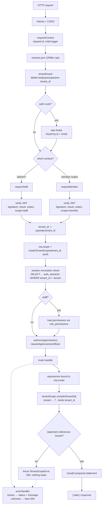
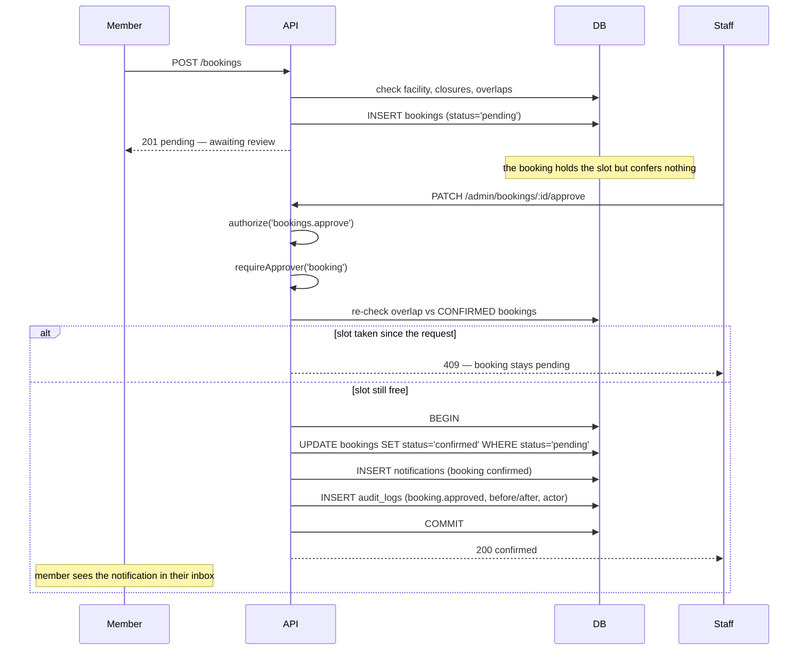
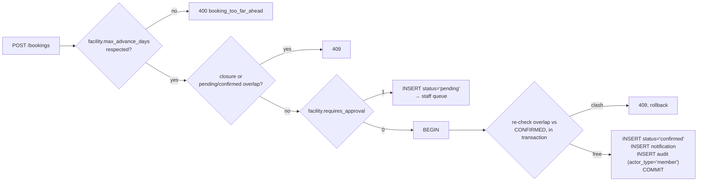

# Architecture

A multi-tenant REST API for membership organisations. Node.js 18+, Express,
MySQL 8, JWT. Every association ("tenant") shares one database and one process;
the whole design question is how to make that safe.

This document covers four things: the tenant isolation model, the auth model,
the approval workflows, and the trade-offs each of them cost.

---

## 1. Request pipeline



The important property of this diagram is what is missing: there is no arrow
from the request body to `tenant_id`. The only edge into the tenant identity is
from the verified token payload.

One deployment-shaped detail sits underneath the rate limiter: `TRUST_PROXY`.
Express derives `req.ip` from `X-Forwarded-For` according to how many hops it is
told to trust, and the limiter keys on that. Set too low, every request arriving
through the proxy shares one bucket and a single busy client locks out everyone
behind it; set too high (or to `true`), a client forges the header and gets a
fresh bucket per request. It is configuration because it is a property of the
topology, not of the code, and `true` is refused outright in production. The key
itself goes through `ipKeyGenerator`, which masks IPv6 to its prefix — keying on
a full IPv6 address would let a client rotate inside its own allocation.

---

## 2. Tenant isolation

### The model

Shared schema, shared tables, `tenant_id` discriminator column. Not
schema-per-tenant, not database-per-tenant. The reasons are in
[§5 Trade-offs](#5-trade-offs); the consequence is that every tenant's rows sit
next to each other and one missing `WHERE tenant_id = ?` is a data breach.

### The enforcement

Three layers, each independently sufficient to stop the common failure, so that
no single mistake is fatal.

**Layer 1 — the tenant scope refuses unscoped SQL.**
`src/data/tenantScope.js`. Feature code never holds a connection pool. It holds
a *scope*: an object bound to one tenant id. Statements passed to the scope must
contain the `:tenant` marker; `compileTenantSql` throws `TenantScopeError`
otherwise, and there is no option to disable it.

```js
// Runs.
await scope.select(
  "SELECT id FROM bookings WHERE tenant_id = :tenant AND status = ?",
  ["pending"]
);

// Throws TenantScopeError before touching the database.
await scope.select("SELECT id FROM bookings WHERE status = ?", ["pending"]);
```

The compiler is a lexical scan that skips string literals, backtick identifiers
and comments, then rewrites `:tenant` to `?` and splices the scope's tenant id
into the parameter array at the matching position. Multiple markers are
supported, which is what makes joins expressible:

```sql
SELECT b.id
  FROM bookings b
  JOIN facilities f ON f.id = b.facility_id AND f.tenant_id = :tenant
 WHERE b.tenant_id = :tenant AND b.status = ?
```

**Layer 2 — the tenant id is not a caller-controlled parameter.**
The value bound to `:tenant` comes from the scope object, not from the `params`
array. A handler cannot pass a different tenant, even deliberately, without
constructing a new scope — and `createTenantScope` only accepts a positive
integer, which in the running system exists in exactly one place: the auth
middleware, reading a verified JWT claim.

`scope.insert(table, values)` sets `tenant_id` itself and **throws** if the
caller supplies one, rather than silently overwriting. A caller trying to set a
tenant id is a bug worth surfacing loudly.

**Layer 3 — client input is stripped at the edge.**
`src/middleware/tenantGuard.js` deletes `tenant_id`, `tenantId`, `tenant` and
`tenant_slug` from body, query and route params before any route runs, and logs
that it did. This is belt-and-braces for the case where someone eventually
writes `scope.insert("bookings", req.body)`.

### What this does not do

`compileTenantSql` is not a SQL parser. It proves the statement *mentions* the
tenant; it does not prove the predicate is correct. This would pass:

```sql
SELECT * FROM invoices WHERE 1 = 1 OR tenant_id = :tenant   -- marker present, predicate useless
```

That is a deliberate boundary. The overwhelmingly common failure in a
shared-schema system is *omission* — someone writes a new query and forgets the
clause. That failure is now impossible. Writing a deliberately broken predicate
is a different, much rarer mistake, and it is visible in review in a way that a
missing line is not.

The alternative that would close the gap completely is MySQL row-level security
via views plus a session variable, or PostgreSQL RLS. See §5.

### The escape hatch

Some queries genuinely have no tenant: resolving a login e-mail before we know
who is logging in, resolving a password-reset token, `SELECT 1`. Rather than
allow those to be written as ordinary queries, they go through
`src/data/global.js`, which requires a named purpose from a fixed allow-list:

```js
await unscopedQueryOne(
  UNSCOPED_PURPOSES.RESOLVE_MEMBER_LOGIN,
  "SELECT id, tenant_id FROM member_credentials WHERE login_email = ?",
  [email]
);
```

Adding a new unscoped query means editing `UNSCOPED_PURPOSES`. That friction is
the point: the complete set of unscoped queries in the codebase is readable in
one file, and a test asserts the list stays short.

### Indexing

Every tenant-owned table leads its lookup indexes with `tenant_id`, so a scoped
query is an index seek rather than a scan with a filter. Examples from
`database/schema.sql`:

| Index | Serves |
|---|---|
| `idx_bookings_slot (tenant_id, facility_id, booking_date, status)` | the overlap check on request and on approval |
| `idx_bookings_tenant_status (tenant_id, status, booking_date)` | the staff review queue |
| `idx_sessions_tenant_token (tenant_id, token_id)` | the per-request revocation check |
| `idx_notifications_member (tenant_id, member_id, read_at, created_at)` | the inbox and the unread badge |

Uniqueness that must hold *per tenant* uses a composite key leading with
`tenant_id` (`uq_members_tenant_number`, `uq_roles_tenant_key`). Uniqueness that
must hold *globally* is a plain unique key — see the login identity note in §3.

---

## 3. Authentication

### Two surfaces, two token scopes

| | Member | Staff |
|---|---|---|
| Login | `POST /auth/login` | `POST /admin/auth/login` |
| Credential table | `member_credentials` | `users` |
| Token `scope` claim | `member` | `staff` |
| Default lifetime | 7 days | 12 hours |
| Route tree | everything except `/admin` | `/admin/*` |

The scope claim is checked during verification, not in a handler. A member token
presented to an admin route fails at `verifyToken(token, SCOPES.STAFF)` before
any handler is reached. Keeping the two trees fully separate means no route can
accidentally become reachable from both — which is the usual way this goes
wrong.

Both token types carry `tenant_id`, `sub` (the credential or user id), `jti`
(the session id), and the staff token additionally carries `role`.

### Where the tenant comes from at login

Login is the one moment an anonymous request acquires a tenant. The sequence is:

1. the client sends an e-mail and a password, and nothing else;
2. the credential row is looked up by e-mail through the unscoped path;
3. `tenant_id` is read **from that row**;
4. a scope is built from it, and the token is signed with it.

The client never names a tenant, at any point, including at login. The direct
consequence is that **login e-mail addresses are unique across the whole
installation, not per tenant** — the same person joining two associations needs
two addresses. The seed data shows this explicitly (`john.smith@example.com` for
Northgate, `john.smith.riverside@example.com` for Riverside).

The alternative is to identify the tenant out of band — a subdomain
(`northgate.api.example.com`), or a path prefix, or an explicit tenant field on
the login form — and scope the credential lookup by it. That would allow
per-tenant e-mail uniqueness, at the cost of a tenant hint that comes from the
client. It is a legitimate design; it would change `credentialRepository` and
nothing else, because everything downstream already takes the tenant from the
token rather than from the request.

### Passwords

bcrypt via `bcryptjs`, cost 12 by default and configurable. Never stored,
logged or returned in any response. Two details worth naming:

- **Constant work on a miss.** `verifyPassword(plain, null)` still runs a bcrypt
  comparison against a dummy hash, so response timing does not disclose whether
  an account exists. The login handler calls it unconditionally.
- **`needsRehash()`** reports hashes produced under a lower cost factor, so the
  cost can be raised without invalidating anyone's password.

argon2id is the better primitive. `bcryptjs` was chosen because it is pure
JavaScript: `npm install` works on any platform with no build toolchain, which
matters for a repository someone will clone and run. Swapping it is a change to
`src/lib/passwords.js` alone.

### Password reset

`POST /auth/forgot-password` → `POST /auth/reset-password`, implemented in
`src/services/passwordResetService.js`. Six properties, each covered by a test:

1. **Single use.** Consuming the token is a conditional update
   (`SET used_at = ? WHERE id = ? AND used_at IS NULL`); the store reports rows
   changed, and zero means someone else got there first. A read-then-write check
   would race with a double click.
2. **Expiring.** `expires_at` is checked against an injected clock, so tests
   move time forward without sleeping.
3. **Hashed at rest.** Only `sha256(token)` is stored. A dump of
   `password_reset_tokens` cannot be replayed as working links. SHA-256 rather
   than bcrypt is correct here: the token is 256 bits of CSPRNG output, so there
   is nothing for a slow KDF to defend against.
4. **No enumeration.** The response envelope is identical whether or not the
   address exists.
5. **One live token per principal.** Issuing a new token burns outstanding ones,
   so a forwarded old e-mail stops working.
6. **Sessions die with the password.** A completed reset revokes every session
   for the principal — resetting a stolen password is pointless if the thief's
   token stays valid.

### Delivering the reset — the notifier seam

This service issues reset tokens and has no way to deliver them. Rather than a
`// TODO` in two route handlers, the integration point is one named module,
`src/services/notifier.js`: an interface with a single method
(`sendPasswordReset`), a default implementation, and `setNotifier()`.

The default records that a reset was issued — tenant, principal, expiry — and
**deliberately does not log the token**. A reset token is a bearer credential;
writing it to the log store turns the log store into a credential store, which
is precisely what the redaction in `src/lib/logger.js` exists to prevent. The
consequence is stated rather than worked around: with the shipped default, a
reset cannot be completed. A deployment registers a transport at startup and
nothing else changes.

Delivery failures are logged and swallowed. If a mail outage produced a 500
while an unknown address still returned 200, the difference between the two
responses would be a user-enumeration oracle — the same leak the generic
envelope was built to close. The envelope has to hold whatever the transport
does.

### Logout and device revocation

A JWT cannot be un-issued, which makes "log out" meaningless on its own. Each
issued token gets a row in `auth_sessions` keyed by its `jti`, and the auth
middleware checks it on every authenticated request.

- `POST /auth/logout` revokes the token that made the call.
- `POST /auth/logout-all` revokes every session for the credential.
- `GET /auth/sessions` lists active devices (marking the current one).
- `DELETE /auth/sessions/:id` revokes one, and only if it belongs to the caller.

The cost is one indexed lookup per authenticated request. It is controlled by
`ENFORCE_SESSION_REVOCATION`, and §5 discusses the trade.

---

## 4. Authorization and approval workflows

### Two authorization mechanisms, on purpose

**`authorize(permission)` — data-driven RBAC.**
`permissions` is a global catalogue of dotted keys (`bookings.approve`,
`members.edit`). `roles` is per tenant. `role_permissions` joins them. A tenant
administrator composes roles from the catalogue, so "who may see the invoice
list" is answered without a deploy.

Permissions are loaded per request rather than embedded in the token. A 12-hour
staff token carrying a stale permission set would mean a revoked permission takes
half a day to take effect. One indexed join per admin request is the right price.

**`requireApprover(workflow)` — operator-controlled policy.**
Which roles may sign off an approval comes from the environment
(`BOOKING_APPROVER_ROLES`, `PROFILE_CHANGE_APPROVER_ROLES`), not from
tenant-editable rows.

The reason the second mechanism exists: RBAC rows are editable by a tenant
administrator, and an approval boundary that the approver can grant themselves
is not a boundary. The environment policy sits outside the data a tenant
controls.

Approval endpoints carry both checks. The RBAC check answers "is this a job
function that touches bookings"; the policy check answers "does this deployment
let that job function sign off". The workflow service re-checks the policy at the
point of the state change, so the guarantee does not depend on a route being
wired up correctly.

### Booking approval



`requires_approval = 0` skips the staff round trip but not the guarantees:



Details that are easy to get wrong:

- **The conflict check runs twice.** The slot was free when the member asked;
  between then and the approval another booking may have been confirmed.
  Validating only at request time double-books the hall.
- **Pending bookings do not block each other for approval.** Two members may
  request the same slot; staff pick one. The request-time check *does* count
  pending bookings, so the availability view does not show a slot as free while
  a request for it is queued.
- **The status change, the notification and the audit record are one
  transaction.** A confirmed booking the member was never told about is a
  support ticket; an audit trail that disagrees with the data is worse than no
  audit trail, because it would be trusted. The repository factory hands the
  transaction callback a fresh repository set bound to the transaction's
  connection, so a workflow cannot accidentally mix a transactional write with a
  pooled one.

The `UPDATE ... WHERE status = 'pending'` predicate makes approval idempotent
under a double click: the second call changes zero rows.

### The two facility-level controls

Both columns exist on `facilities`, are returned by `GET /facilities`, and are
enforced server-side. A column the API publishes and then ignores is worse than
a missing feature, because a client that respects it is doing the server's job.

**`requires_approval`.** Set to 0, a booking on that facility is confirmed at
creation. This is not a bypass: `createAutoConfirmed()` re-checks the overlap
against confirmed bookings *inside* the transaction, notifies the member, and
writes the same audit record. What differs is who decided, and the audit row
says so — `actor_type = 'member'`, action `booking.auto_confirmed`, with
`reason: "facility.requires_approval = 0"`. A reviewer reading the trail can
tell a self-service confirmation from a staff decision.

**`max_advance_days`.** A booking further ahead than the facility allows is
rejected with the code `booking_too_far_ahead` and a message naming the limit.
The comparison is in whole UTC calendar days via an injected clock, which is why
the boundary (exactly the limit is accepted; one day past is not) is testable
without waiting.

### The audit trail

`audit_logs` is written by the workflows, inside the same transaction as the
state change. Every approval, rejection, auto-confirmation, completed password
reset and session revocation produces a row carrying the actor, the action, the
entity, and the before/after the workflow already had in hand.

Three properties worth naming:

- **Append-only by construction.** `auditRepository` exposes `record`, `list`
  and `listForEntity`. There is no update and no delete, and the HTTP surface
  (`GET /admin/audit-logs`) is read-only. An audit log with an edit endpoint is
  not an audit log.
- **Credentials cannot get in.** `record()` refuses any metadata key matching
  `password|token|secret|hash|credential`. The trail records *that* a password
  was reset and how many sessions it killed, never the token or the hash.
- **One documented exception to the transaction rule.** The completed-password-
  reset row is written outside a transaction, because that request has no tenant
  scope — the caller is not logged in — and plumbing a pooled connection through
  the unscoped layer to save one row would widen the escape hatch that §2
  exists to keep narrow. The consequence is a narrow window where a password
  change could commit without its audit row. Accepted there; not accepted for
  the approval workflows, which do use a transaction.

The action vocabulary is fixed (`ACTIONS` in `src/repositories/auditRepository.js`)
and namespaced, so the same string appears in code, in the database and in the
`GET /admin/audit-logs/actions` response a UI builds its filter from.

### Profile change approval

Same shape, different stakes. A member cannot edit their own record — there is
no `PUT /profile`. `POST /profile/change-requests` writes the proposed values
into `profile_change_requests` with `status = 'pending'` and a snapshot of the
current values; `members` is untouched until approval.

Why: an association's member register is a legal record, and the contact details
on it are what dues notices and access rights hang off.

The editable-field allow-list (`MEMBER_EDITABLE_FIELDS`) is applied **twice** —
when the request is created and again at approval. The second filter matters: the
allow-list may have shrunk in between, and an approver clicking "approve" should
not be able to write a field the configuration no longer permits. A request with
nothing left to apply is refused rather than silently approved.

`memberRepository.applyChanges()` is the only place in the codebase that builds a
`SET` clause dynamically. Every column name is checked against both an identifier
pattern and the configured allow-list before interpolation; values stay
parameterised.

---

## 5. Trade-offs

**Shared schema over schema-per-tenant or database-per-tenant.**
Chosen for operational cost: one migration run, one connection pool, one backup,
cross-tenant analytics without federation. The price is that isolation is an
application-layer guarantee rather than a database-layer one — hence
`tenantScope.js` and the three layers above. Database-per-tenant makes a leak
structurally impossible but turns a schema change into an N-database operation
and makes connection pooling awkward past a few hundred tenants. For an
association platform, where tenants are numerous and small, shared schema is the
right shape and the isolation has to be earned in code.

**A marker convention over row-level security.**
PostgreSQL RLS (or MySQL views over a session variable) would enforce isolation
in the database, where the application cannot get it wrong at all. It would also
mean every connection must set and reliably reset a session variable — which,
with a connection pool, is its own class of bug — and it ties the design to one
engine's feature set. The marker approach converts the common failure (omission)
into a loud exception while staying portable. The residual gap (a present but
wrong predicate) is stated in §2 rather than hidden.

**Stateful sessions over pure stateless JWTs.**
Pure JWTs cost nothing per request but cannot be revoked, so "log out", "revoke
this device" and "invalidate sessions after a password reset" are all
unimplementable. Given that this is an API for an organisation that holds
members' contact details and billing status, the indexed lookup is worth it. It
is a config flag so a deployment that disagrees can turn it off knowingly rather
than by omission.

**A repository layer only where there is domain logic.**
Bookings, profile changes, notifications, sessions, credentials and password
resets have repositories, because there are workflow rules worth unit-testing
against in-memory doubles. Simple read endpoints (invoices, guest passes) query
`req.scope` directly. Adding a repository per table for symmetry would be more
code with no new guarantee — the scope already makes those reads safe by
construction.

**Soft deletes are NOT enforced by the scope compiler — considered and rejected.**
Seven of the twenty tables carry `deleted_at`, and every read against them
writes `AND deleted_at IS NULL` by hand. That is, on its face, the same failure
mode the tenant marker eliminates: a predicate a human has to remember. Extending
`compileTenantSql` to demand it was considered and deliberately not done, for
three reasons.

*It is not a universal invariant.* The tenant predicate applies to every
statement against every tenant-owned table, with no legitimate exception — which
is exactly what makes "refuse to compile without it" a rule and not a nuisance.
Soft-delete does not: only some tables have the column; `INSERT` and the
`UPDATE` that performs the deletion must not carry it; an administrative view of
deleted records legitimately omits it; `COUNT(*)` for a retention report wants
the deleted rows.

*A rule you suppress half the time trains people to suppress it.* Enforcement
would need an opt-out — `scope.selectIncludingDeleted(...)` or a flag — and the
moment an opt-out exists, the guard's value drops to whatever discipline it was
supposed to replace. The tenant marker has no opt-out; that is the whole reason
it works.

*The blast radius is different.* Forgetting `tenant_id` shows one association
another's data: a breach. Forgetting `deleted_at IS NULL` shows a member a
record their own tenant soft-deleted: a bug, visible to the tenant, fixed in one
line. Spending the same mechanism on both would suggest they carry the same
weight.

What is done instead: the column is on exactly the tables that need it, the
predicate is in the repositories rather than scattered through route handlers,
and this paragraph exists so the asymmetry reads as a decision. If the schema
grew to where most tables were soft-deletable, the calculus would change and a
`softDeletes: true` table registry with a compile-time check would earn its
place.

**Hand-rolled validation and logging over dependencies.**
`src/lib/validate.js` is ~120 lines and covers the types this API accepts;
`src/lib/logger.js` is ~100 lines and does structured output plus credential
redaction. Both are places where a dependency would be defensible. They were
kept in-house because the surface is small, the behaviour is exactly what is
needed (allow-list validation; redaction by key pattern at any depth), and the
alternative is a transport stack the service does not use. If the API surface
grew several times over, `zod` and `pino` would earn their places.

**Integer minor units for money.**
`amount_cents INT UNSIGNED` rather than `DECIMAL(10,2)`. DECIMAL read into a
JavaScript number is how a cent goes missing. The API returns cents and lets the
client format.

**Payments and physical access are absent, not stubbed; delivery is a seam.**
Invoices are read-only. Guest passes are issued but never redeemed at a door.
Each of those needs an external integration with its own idempotency, retries
and reconciliation; a placeholder that looks like the real thing is worse than
an honest absence.

E-mail is treated differently, because the difference matters: it is not absent,
it is *unimplemented behind a defined interface*. `src/services/notifier.js` is
the seam, both call sites already go through it, and a deployment supplies the
transport. An integration point with a name and a contract is a design decision;
a `// TODO` in a route handler is an unfinished one. `NOTES.md` enumerates what
is genuinely missing.
